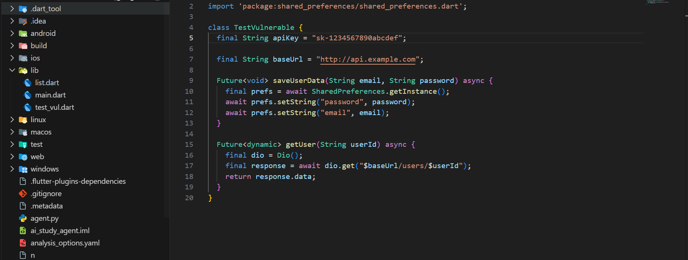
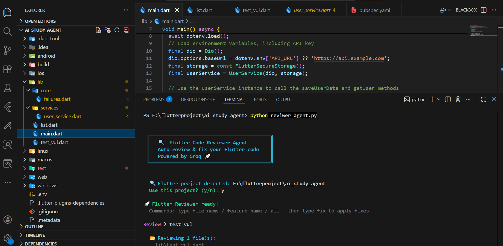
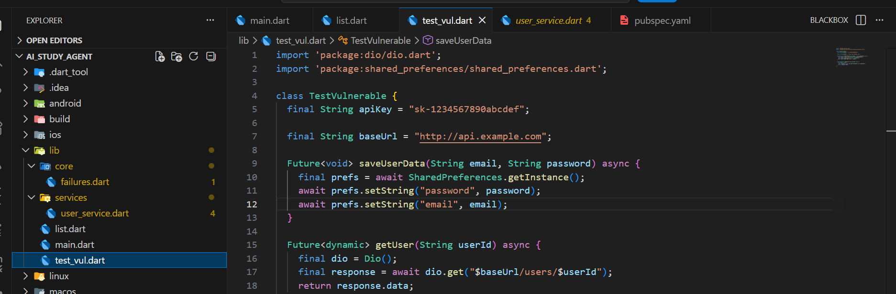
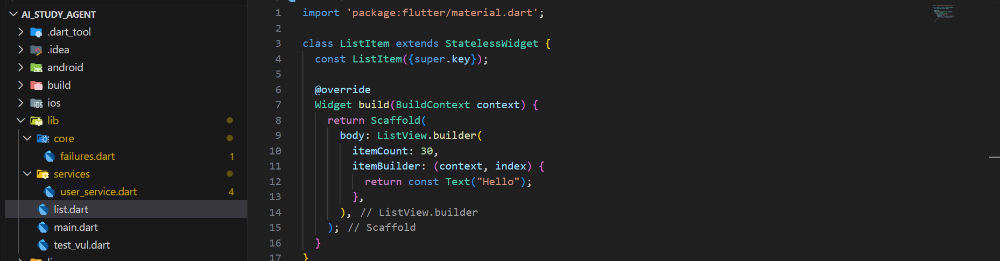
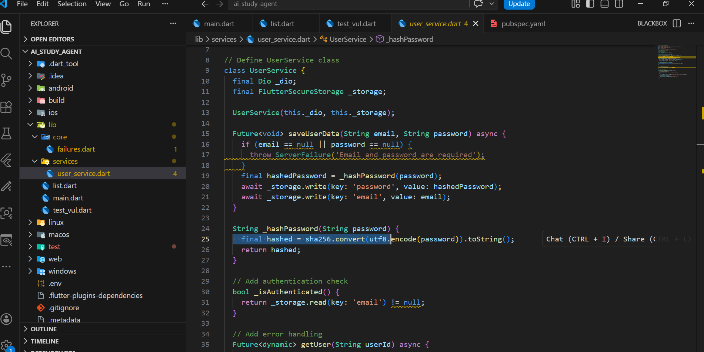
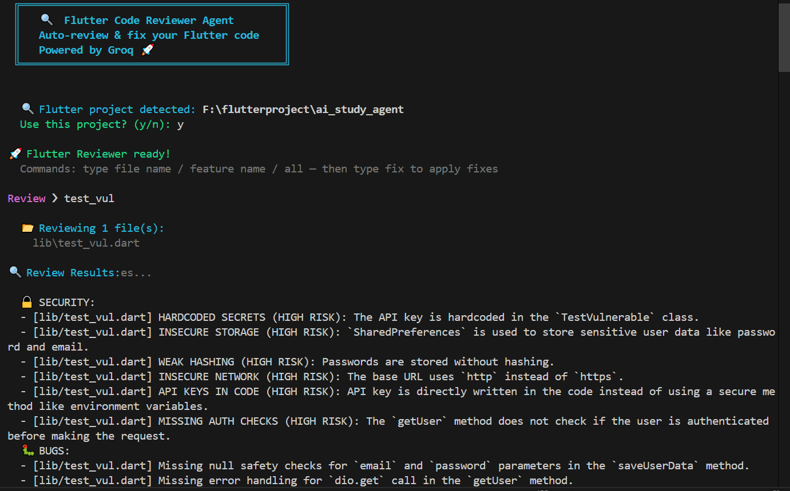
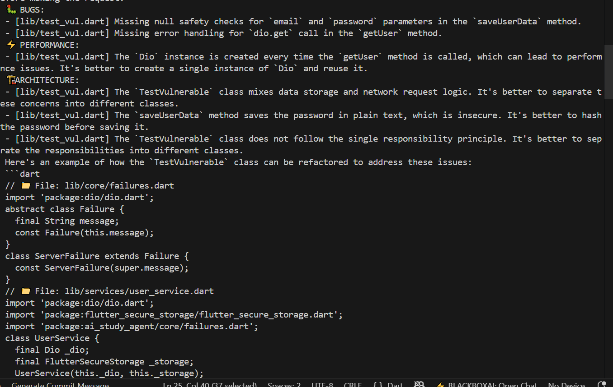

<!DOCTYPE html>

<title>Flutter Code Reviewer Agent - README</title>

</head>
<body>

<h1>🔍 Flutter Code Reviewer Agent</h1>

An AI-powered terminal agent that automatically reviews Flutter/Dart code, detects vulnerabilities, and applies fixes using Groq LLaMA 3.3 70B.

<h2>✨ Features</h2>
Security Checks
Bug Detection
Performance Optimization
Architecture Review
Auto Fix
AI Powered

<h2>📸 Before & After Results</h2>

<h3>❌ Before</h3>

Vulnerable and bad structured code

<h3>✅ After</h3>

Clean, secure and optimized code

<h2>🖥️ Terminal Output</h2>

<h2>⚙️ How It Works</h2>
<ul>
<li>Detect Flutter project automatically</li>
<li>Scan Dart files</li>
<li>Send code to Groq LLaMA 3.3 70B</li>
<li>Analyze security, bugs, performance</li>
<li>Suggest and apply fixes</li>
<li>Run dart analyze</li>
</ul>

<h2>🚀 Run Project</h2>
<pre>
pip install groq python-dotenv
</pre>

<h3>Create .env</h3>
<pre>
GROQ_API_KEY=your_key_here
</pre>

<h3>Run Agent</h3>
<pre>
python reviewer_agent.py
</pre>

<h2>💬 Commands</h2>
<pre>
all        → scan full project
filename   → scan file
list       → show files
exit       → close agent
</pre>

<h2>🎯 Goal</h2>

Make Flutter code production-ready automatically with AI-powered review and fixes.

</body>
</html>
